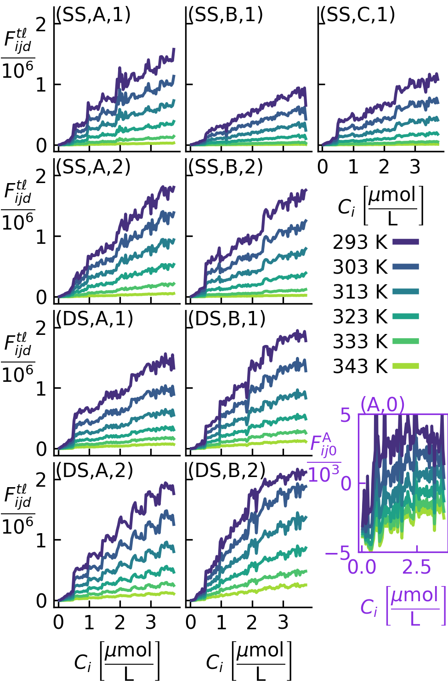
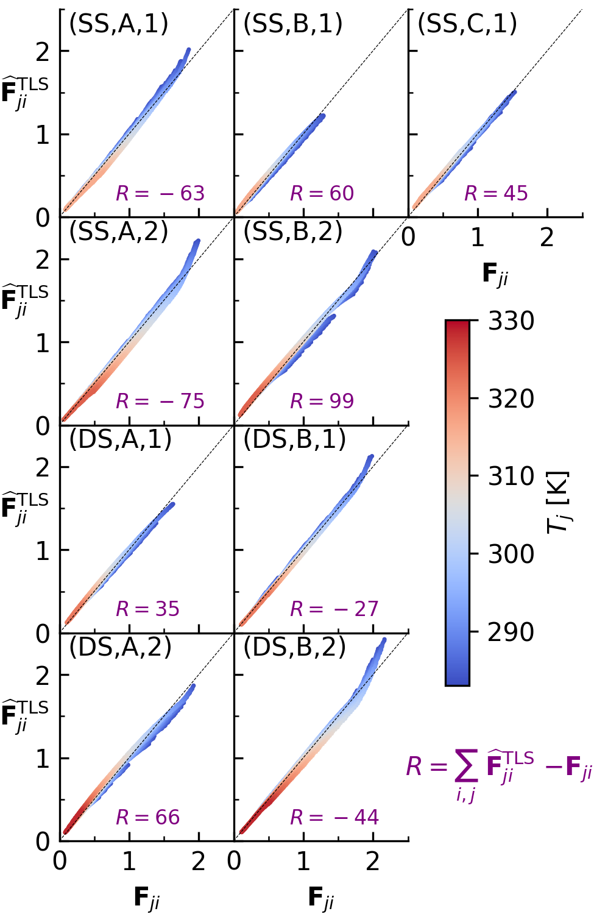
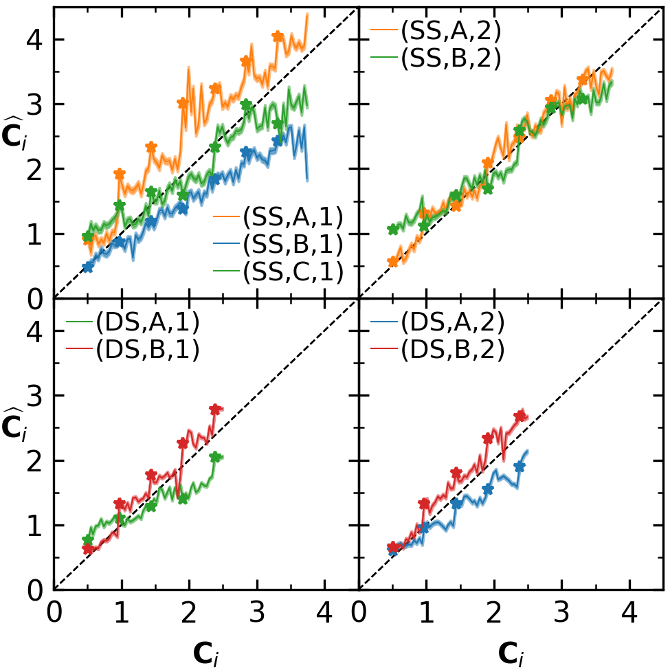
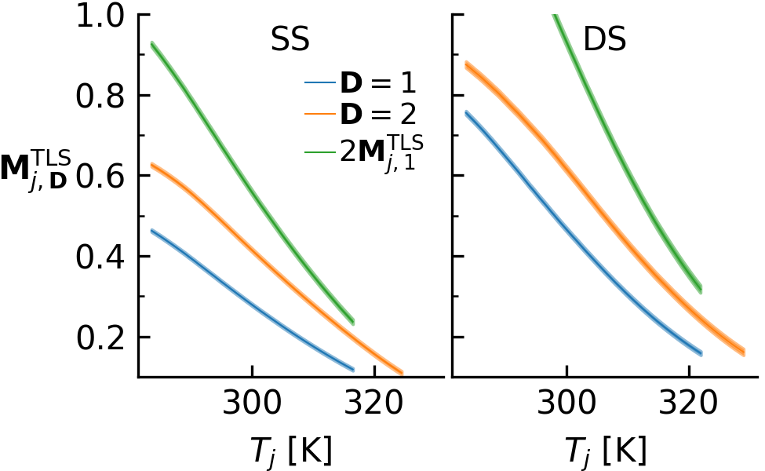
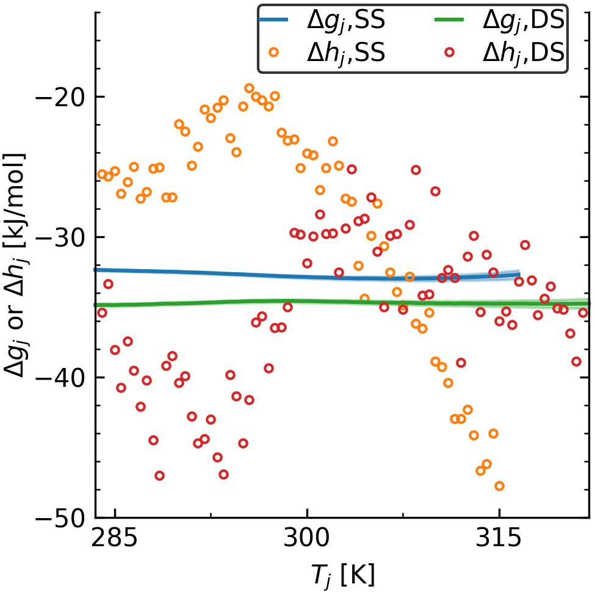
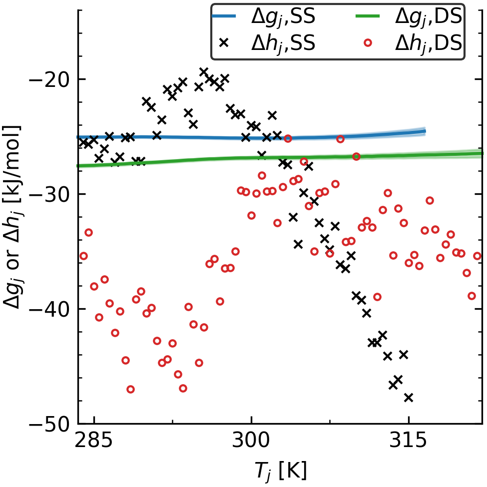

# Reproducing the Manuscript

## Raw Data and Scaling

First, we read-in the data associated 
with each data set (see Table 1 in paper)
and store as an instance of `src.get_data.RawData`.

    >>> import sys, os; sys.path.append(os.getcwd())
    >>> from src.get_data import RawData

The data for 
each replicate plate 
possessing single-stranded DNA with $D_k=1\times10^{-6}$ mol/L is
input into the following structures

    >>> kwargs = dict(t="SS", B_d=22e-6, N=22)
    >>> SS_A_1 = RawData(fluorescence_file_name="ssDNA_2-23-2021.xls", l="A", **kwargs)
    >>> SS_B_1 = RawData(fluorescence_file_name="8-2-2021_GC_ssDNA.xls", l="B", **kwargs)
    >>> SS_C_1 = RawData(fluorescence_file_name="1xSS_GC_11-3-2021_data.xls", l="C", **kwargs)

The data for 
each replicate plate 
possessing single-stranded DNA with $D_k=2\times10^{-6}$ mol/L is
input into the following structures

    >>> kwargs = dict(t="SS", B_d=44e-6, N=22)
    >>> SS_A_2 = RawData(fluorescence_file_name="2x_ssDNA_2-24-2021.xls", l="A", **kwargs)
    >>> SS_B_2 = RawData(fluorescence_file_name="gc_2xssDNA_11-2-2021_data.xls", l="B", **kwargs)

The data for 
each replicate plate 
possessing double-stranded DNA with $D_k=1\times10^{-6}$ mol/L is
input into the following structures

    >>> kwargs = dict(t="DS", B_d=22e-6, N=22)
    >>> DS_A_1 = RawData(fluorescence_file_name="GC_0p5_dsDNA_11-2-2021.xls", l="A", **kwargs)
    >>> DS_B_1 = RawData(fluorescence_file_name="gc_dsDNA_1uM_12-10-2021_data.xls", l="B", **kwargs)

The data for 
each replicate plate 
possessing double-stranded DNA with $D_k=2\times10^{-6}$ mol/L is
input into the following structures

    >>> kwargs = dict(t="DS", B_d=44e-6, N=22)
    >>> DS_A_2 = RawData(fluorescence_file_name="8-2-2021_GCdsDNA.xls", l="A", **kwargs)
    >>> DS_B_2 = RawData(fluorescence_file_name="gc_dsDNA_2uM_12-9-2021_data.xls", l="B", **kwargs)

The data for the plate 
without DNA
is input into the following structure

    >>> A_1 = RawData(fluorescence_file_name="dyeOnly_11-6-2021_data.xls", B_d=0., t="None", l="A", N=0)

Having read-in the raw data, we plot it via

    >>> from src.plot_raw_data import make_figure_2
    >>> make_figure_2(SS_A_1, SS_B_1, SS_C_1, SS_A_2, SS_B_2, DS_A_1, DS_B_1, DS_A_2, DS_B_2, A_1)

which looks like

 
    

We combine the replicate plates by storing them as a
`src.get_data.CombinedData` class.

    >>> from src.get_data import CombinedData

The data for single-stranded DNA at $\mathbf{D}=1$ is 

    >>> SS_1 = CombinedData(SS_A_1, SS_B_1, SS_C_1)

The data for single-stranded DNA at $\mathbf{D}=2$ is 

    >>> SS_2 = CombinedData(SS_A_2, SS_B_2)

The data for double-stranded DNA at $\mathbf{D}=1$ is 

    >>> DS_1 = CombinedData(DS_A_1, DS_B_1)

The data for double-stranded DNA at $\mathbf{D}=2$ is 

    >>> DS_2 = CombinedData(DS_A_2, DS_B_2)

Having combined the data, we calculate $F_\mathrm{min}$ via

    >>> F_min = 0
    >>> F_min_sum = 0
    >>> n_min_avg = 0
    >>> from src.get_data import C_REF, F_REF
    >>> for dataset in (SS_1, SS_2, DS_1, DS_2):
    ...     wells = dataset.C*C_REF <= 0.5e-6
    ...     "Num wells <= 0.5e-6 mol/L for %s, %i is %d" % (dataset.t, int(dataset.D), len(dataset.C[wells]))
    ...     max_t_D = dataset.F[:, wells].max()*F_REF
    ...     n_min_avg += len(dataset.C[wells])*len(dataset.T)
    ...     F_min_sum += dataset.F[:, wells].sum()*F_REF
    ...     if max_t_D > F_min:
    ...         F_min = max_t_D
    ...
    'Num wells <= 0.5e-6 mol/L for SS, 1 is 36'
    'Num wells <= 0.5e-6 mol/L for SS, 2 is 24'
    'Num wells <= 0.5e-6 mol/L for DS, 1 is 24'
    'Num wells <= 0.5e-6 mol/L for DS, 2 is 24'
    >>> F_min_avg = F_min_sum / n_min_avg

The value for $F_\mathrm{min}$ is

    >>> F_min
    231432.0

while the average fluorescence for low dye concentrations is

    >>> F_min_avg
    27433.101518784973

The subsets of the data are made via

    >>> for dataset in (SS_1, SS_2, DS_1, DS_2):
    ...     dataset.make_subset(F_min/F_REF)
    ...     "%s %i %3.2f %3.2f %5.1f %5.1f" % (
    ...         dataset.t, int(dataset.D), 
    ...         dataset.C.min(), dataset.C.max(), 
    ...         dataset.T.min(), dataset.T.max()
    ...     )
    ...
    'SS 1 0.51 3.74 283.5 316.5'
    'SS 2 0.51 3.74 283.5 324.5'
    'DS 1 0.51 2.49 283.5 322.0'
    'DS 2 0.51 2.49 283.5 329.0'

## Quantifying Noise and Linearity

First, we import libraries used

    >>> import numpy as np

For each dataset, compute $\mathbf{M}^\mathrm{LS}$ via Equation (21)
and store the results,

    >>> from src.noise_removal import compute_M_LS
    >>> F_hats = []
    >>> for dataset in (SS_1, SS_2, DS_1, DS_2):
    ...     M_LS = compute_M_LS(dataset.F, dataset.C)
    ...     F_hats.append(np.outer(M_LS, dataset.C))
    ...

and then plot $\mathbf{F}$ vs $\widehat{\mathbf{F}}$ for
each combination via

    >>> from src.plot_noise_removal import plot_Fhat_vs_F
    >>> plot_Fhat_vs_F(
    ...     (SS_1.F, SS_2.F, DS_1.F, DS_2.F), 
    ...     tuple(F_hats),
    ...     (SS_1.T, SS_2.T, DS_1.T, DS_2.T), 
    ...     "figure4.png", 
    ...     sname=r"$\widehat{\mathbf{F}}_{j,i}^\mathrm{LS}$")
    ...

This is Figure 4 in the main text, which looks like

 
    

Subsequently, Equation (22) is solved
using `src.noise_removal.predictor_corrector`
and $V(\mathbf{M})$ and $V(\mathbf{C})$
are calulated 

    >>> from src.noise_removal import predictor_corrector
    >>> RHO_SQUARED = 0.1
    >>> for dataset in (SS_1, SS_2, DS_1, DS_2):
    ...     dataset.M_tls, dataset.C_hat = predictor_corrector(
    ...         dataset.F, dataset.C, RHO_SQUARED
    ...     )
    ...     dataset.Fhat_tls = np.outer(dataset.M_tls, dataset.C_hat.T)
    ...     
    ...     m, n = dataset.F.shape
    ...     H = np.vstack([
    ...             np.hstack([np.eye(n)*(RHO_SQUARED+np.inner(dataset.M_tls, dataset.M_tls)), np.zeros((n, m))]),
    ...             np.hstack([np.zeros((m, n)), np.eye(m)*np.inner(dataset.C_hat, dataset.C_hat)])
    ...         ])
    ...     dF = dataset.Fhat_tls - dataset.F
    ...     dC = dataset.C_hat - dataset.C
    ...     f_star = (dF*dF).sum() + RHO_SQUARED*(dC*dC).sum()
    ...     bbV = f_star / (m*(n-1))*np.linalg.inv(H)
    ...     dataset.V_C = np.array([bbV[i, i] for i in range(n)])
    ...     dataset.V_M = np.array([bbV[j, j] for j in range(n, n + m)])
    ...
    ...     dataset.M_std = np.sqrt(dataset.V_M)
    ...     dataset.C_std = np.sqrt(dataset.V_C)
    ...
    Total number of iterations was 756
    Total number of iterations was 1347
    Total number of iterations was 1928
    Total number of iterations was 3073

The results are plotted via Figure 5

    >>> plot_Fhat_vs_F(
    ...     (SS_1.F, SS_2.F, DS_1.F, DS_2.F),
    ...     (SS_1.Fhat_tls, SS_2.Fhat_tls, DS_1.Fhat_tls, DS_2.Fhat_tls),
    ...     (SS_1.T, SS_2.T, DS_1.T, DS_2.T), 
    ...     "figure5.png", 
    ...     sname=r"$\widehat{\mathbf{F}}_{j,i}^\mathrm{TLS}$")
    ...

which looks like

 
    

and Figure 6,

    >>> from src.plot_noise_removal import plot_Chat_vs_C
    >>> plot_Chat_vs_C(
    ...     (SS_1.C, SS_2.C, DS_1.C, DS_2.C), 
    ...     (SS_1.C_hat, SS_2.C_hat, DS_1.C_hat, DS_2.C_hat), 
    ...     (SS_1.C_std, SS_2.C_std, DS_1.C_std, DS_2.C_std), 
    ...     "figure6.png"
    ... )
    ...

which looks like

 
    

and Figure 7,

    >>> from src.plot_noise_removal import plot_figure7
    >>> plot_figure7(
    ...     (SS_1.M_tls, SS_2.M_tls, DS_1.M_tls, DS_2.M_tls),
    ...     (SS_1.M_std, SS_2.M_std, DS_1.M_std, DS_2.M_std),
    ...     (SS_1.T, SS_2.T, DS_1.T, DS_2.T)
    ... )
    ...

which looks like

 
    

## Parameter Extraction

First, we combine the DNA
concentrations associated with each DNA type
into an instance of `src.parameter_extraction.Parameters`

    >>> from src.parameter_extraction import Parameters
    >>> SS = Parameters(SS_1, SS_2)
    >>> DS = Parameters(DS_1, DS_2)

These instances now 
have methods that perform all parameter calculations;
we can readily plot the Figure 8 as

    >>> from src.plot_params import plot_figure8
    >>> plot_figure8(
    ...     SS.T, SS.get_f(), SS.get_K(), SS.get_f_std(), SS.get_K_std(),
    ...     DS.T, DS.get_f(), DS.get_K(), DS.get_f_std(), DS.get_K_std(),
    ... )
    ...

which looks like

 
    

The association constant is calculated as

    >>> K_a = DS.get_K()/2/C_REF/DS.N*1e-6
    >>> d_K_a = DS.get_K_std()/2/C_REF/DS.N*1e-6
    >>> "K_a at %3.2f K is %f +/- %f" % (DS.T[-24], K_a[-24], 3.*d_K_a[-24])
    'K_a at 295.00 K is 0.030529 +/- 0.001505'

We plot Figure 9 via

    >>> from src.plot_params import plot_figure9
    >>> plot_figure9(SS, DS)
    dg_SS at 295.00 K is -25.101401 +/- 0.088140
    dg_DS at 295.00 K is -27.026988 +/- 0.108761
    dh_DS average over all temperatures is -35.4 +/- 5.3 kJ/mol
    Tds_DS average over all temperatures is -8.4 +/- 5.2 kJ/mol

which looks like

 
    

## Supplementary Figures

Figure S1 and S2 are made via

    >>> from src.plot_raw_data import make_figure_S1, make_figure_S2
    >>> make_figure_S1()
    >>> make_figure_S2()
    Maximum change from 6/15 to 6/16: 32841
    Minimum change from 6/15 to 6/16: -4525
    Average change from 6/15 to 6/16: 4085

Figure S3, S4, S5, and S6 are made via

    >>> from src.plot_params import plot_figure_S3, plot_figure_S4, \
    ...     plot_figure_S5, plot_figure_S6
    >>> plot_figure_S3(SS_1, SS_2, DS_1, DS_2)
    >>> plot_figure_S4(SS, DS)
    >>> plot_figure_S5(SS, DS)
    >>> from src.parameter_extraction import calculate_relative_brightness, \
    ...     calculate_relative_brightness_err 
    >>> rb = calculate_relative_brightness(SS.get_f(), DS.get_f())
    >>> d_rb = calculate_relative_brightness_err(SS.M1, SS.M2, DS.M1, DS.M2,
    ...     SS.V_M1, SS.V_M2, DS.V_M1, DS.V_M2)
    >>> plot_figure_S6(SS.T, rb, d_rb)